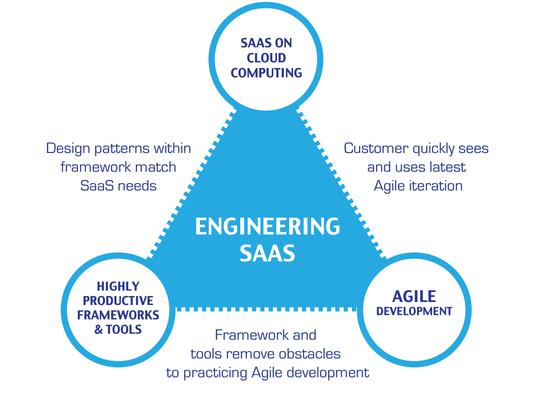

# GitAssignmentOG

Topics Addressed:

1. Plan-and-Document 
2. Agile Software Development
3. Software Quality (QA)
4. Software as a Service (SaaS)
5. Legacy Code

| Development Processes |
| ------ |

| P&D | Agile |
| ----------- | ----------- |
| Processes and tools | Individuals and interactions |
| Comprehensive documentation | Working software |
| Contract negotiation | Customer collaboration |
| Following a plan | Responding to change |

I'm excited to learn more about github this semester! :shipit:

